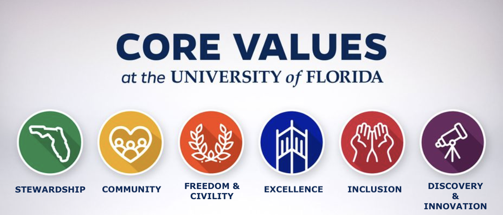
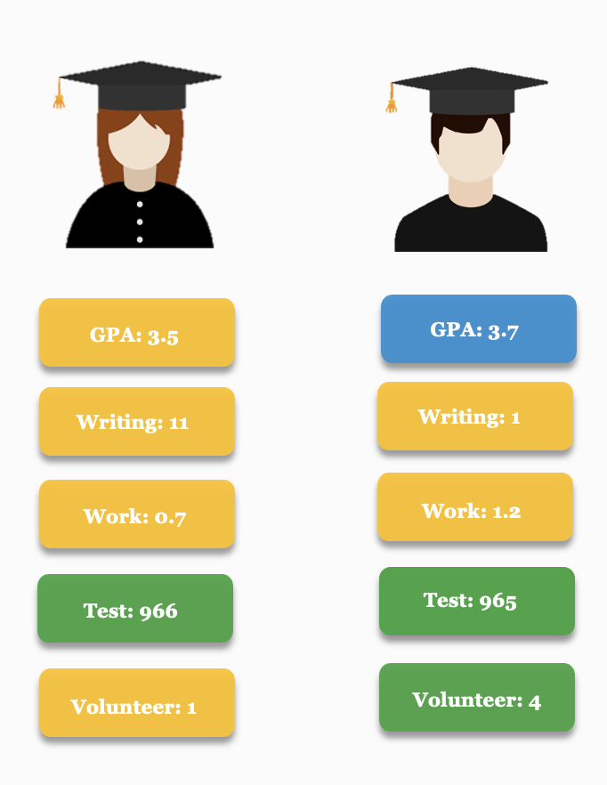

<style type="text/css">
  body{
  font-family: PT Sans Narrow;
  font-size: 16pt;
}
</style>

```{r setup,  include=FALSE}
knitr::opts_chunk$set(echo = TRUE)

library(prettydoc)
library(tidyverse)
```


# The College Admissions Scandal

In recent events, a scandal arose involving top American universities and a criminal conspiracy to unfairly influence undergraduate admissions decisions. Notable celebrities like Lori Loughlin and Felicity Huffman flexed their status and wealth in order to bend the rules and loosen admissions requirements for their children. Dozens of individuals were charged due to their involvement and prestigious universities such as Yale, Standford, Georgetown, University of Southern California, and more became embroiled in a scandal which directly reflected on their dedication to their values. 

Here at the University of Florida, we are driven by our values and our dedication to them. Not only has this inspired an effort to internally review our own admissions process, but it has presented an opportunity to get ahead of the curve and to better it. As a Top 5 public school in the US, we seek to stand out and to serve as a model to other schools nationwide.
<br><br>

# Impact to UF
<br>
<center>
{width=100% height=70%}
<br><br></center>

The main impact of our research is to serve all prospective students and applicants. We seek to imbue our values into our admissions process so that every student may be assessed fairly, so that UF can continue to be a hub for Excellence, Discovery & Innovation, Inclusion, and more. 
<br><br>

<center>
<b>
UF Teams Impacted </b>

UF Leadership

UF Diversity Office
</center>
<br>

# Research & Findings 

## Performance Metrics 

<center>
<iframe src="output/school_performance.html" width="100%" height="500" data-external=1 style="border:none;">
</iframe>
</center>

When comparing the different School Performance Metrics we see that **admitted** students typically have the highest average performance, with **waitlisted** students slightly below and **declined** students with the lowest average performance. This makes sense and follows our goals of building a community of students that can unlock their highest potential. However, we do not observe the same pattern with extracurricular performance.    


<iframe src="output/extracurricular_performance.html" width="100%" height="500" data-external=1 style="border:none;">
</iframe>


Average work experience is actually lowest for our **admitted** students. Generally however, the average work experience for all students is relatively uniform regardless of whether the applicant was accepted, denied, or waitlisted. 

Average volunteer experience is similar but we see the difference between **admitted** and non-admitted students much clearer. **Declined** and **waitlisted** applicants have higher levels of volunteer experience than those who were admitted. This finding in our review process presents a possible deficiency in our admissions process. We are not holistically viewing students outside of their quantitative metrics during the selection process.

## Applicants by State


<iframe src="output/choropleth.html" width="900" height="400" data-external=1 style="border:none;">
</iframe>


## Outliers 

<font size="5">**A good and bad example**</font>

<iframe src="output/workexp_writing.html" width="900" height="400" data-external=1 style="border:none;">
</iframe>

When observing relationships between different metrics, some applicants stand out as unusual or edge cases. Let's take a look at an example:

<center>
{height=500px width=50%}
</center>

The student on the left was admitted despite performing below average on most of the evaluation metrics. The student on the right was admitted due to a comprehensive evaluation. He performed above average on some metrics, below average on others, and average on GPA.

# Recommendations

Students are more than just numbers. We at the University of Florida seek to culminate a diverse student body and open our doors to every kind of excellence. 

<br> 

**Value Alignment Team** 

 - We propose organizing a group comprised of leadership and faculty. The function of this team is to align the University's mission and core values with the admission selection process.

<br>

**Becoming More Data Driven**

- We propose storing more data on applicants in the coming semesters. There are a myriad of obligations a student may take on before college that could take time away from their studies, resulting in lower standardized testing scores and other metrics. We recommend including:
  
  - Other extra curriculars (sports, clubs, honor societies, community involvement, leadership)
  
  - Personal Statements, essay questions, diversity statements, letters of recommendation
  
  - Socio-economic factors, financial aid status

<br> 
**Getting Specific: Work Experience**

<br>

> <big>**<big style="font-size:50px; color:#005496;">35%</big>** of postings for entry level positions and **<big style="font-size:50px; color:#005496;">60%</big>** of entry level positions in  software and IT, ask for relevant work experience </big>

<br> 

According to the <a href="https://www.bbc.com/worklife/article/20210916-why-inexperienced-workers-cant-get-entry-level-jobs" > BBC </a>, 35% of postings for entry level positions ask for years of prior relevant work experience. This is even more common in the software and IT industry where 60% of entry level positions require work experience. In order to give our students an edge after graduation and to simultaneously maintain a competitive job placement rate for the University, we should be encouraging students to pursue work/internship/volunteering opportunities but also, accept students who have already demonstrated this.  

# Code 
Check out the code used in our analysis [here](https://github.com/monroefarris/anly599)!
<br><br>